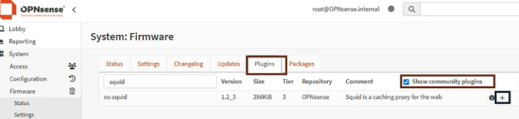
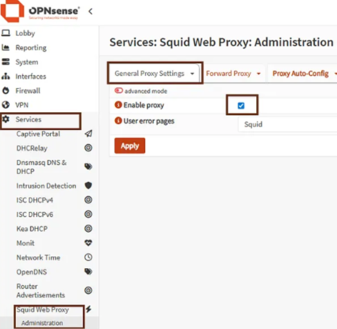
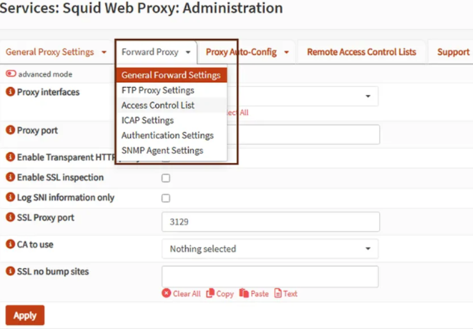

Je me suis aidé sur cette [source](https://medium.com/@madlenscholz71/how-to-install-and-configure-the-squid-web-proxy-on-opnsense-41399cf022fa) pour la réalisation du projet.

### Installation de Squid
Se connecter à l'interface web de OPNsense (via l'adresse ip de la machine).  

Mettre à jour le firmware via : **System**, **Firmware**, **Status** et **Check for updates**. En bas de la page, cliquer sur Update et reboot la machine. Se reconnecter.  

Aller dans **System**, **Firmware**, **Plugins**.  
Dans la barre de recherche, taper "_squid_" et cocher **Show community plugins**.  
Cliquer ensuite sur le **+** pour démarrer l'installation.  
  
Vérifier dans **System** la présence de **Squid web proxy**.  
### Configuration du proxy de transfert (forward proxy)  
Le terme proxy de transfert correspond à _Forward proxy_ en anglais. Il est également appelé _Proxy_ par abus de langage.  

Aller dans **Services**, **Squid Web Proxy**, **Administration**.  
Cocher **Enable proxy** puis **Apply**.  
  

Aller dans l'onglet **Forward Proxy**, **General Forward Settings**  
  

**Proxy interfaces** : Sélectionner le(s) réseau(x) LAN. Squid sera en écoute pour les requêtes venant de ce(s) réseau(x).  
**Proxy port** : Choisir le port pour les requêtes HTTP.  
**SSL Proxy port** : Choisir le port pour les requêtes HTTPS.  
Le port par défaut de Squid est 3129. Il est devenu courant pour les proxy en général, donc on peut le laisser pour ces deux paramètres.  
**Enable Transparent HTTP proxy** : ne pas cocher, l'idée ici et d'en faire un proxy explicite pour une meilleure configuration.  
**Enable SSL inspection** : Si une CA a été crée, alors cette option peut être cochée. Sinon, laisser décoché.  
**Log SNI Information only** : Limite les logs au SNI (nom de domaine), sans l'url complète, paramètres ni contenu HTTPS. A cocher en cas de contexte sensible.  
**CA to use** : Choisir la CA voulue s'il en existe une de créée.  
**SSL no bump sites** : Exceptions qui ne seront jamais déchiffrées/inspectées. Banques, santé, etc.  

**Apply**

### Création d'une CA et certificat
Se référer à la documentation de dépot [ici](https://github.com/Azortix/CA_-_Certificat)

### Gestion des ACL

Toujours dans **Services, Squid Web Proxy, Administration** cliquer sur le triangle pour ouvrir le menu déroulant. Aller dans **Access Control List**.  
Plusieurs paramètres sont configurables :  
**Allowed Subnets** : Cela dit à Squid quel réseau sera autoriser à utiliser le service. Entrer les réseaux LANs, ex : 172.16.10.0/24  
**Unrestricted IP addresses** : Réseaux non affectés par les restrictions  
**Banned host IP addresses** : Entrer les postes à bloquer complètements (poste compromis ou autre)  
**Whitelist** : Entrer les domaines non affectés par les restrictions, ex : .google.com  
**Blocklist** : Entrer les domaines bloqués, ex : .youtube.com  

**Apply**

### Création de règle parefeu
Créer une règle parefeu pour autoriser les clients en LAN d'envoyer du traffic vers le port du proxy. Autrement, le parefeu bloquerait les requêtes avant même d'arriver jusqu'au proxy.  

Aller dans **Firewall, Rules, Floating**. (Ou sur l'interface LAN si l'on a qu'un seul LAN)  
Créer une nouvelle règle via le **+** en haut à droite.  
**Action:** `Pass`  
**Interface:** Cocher les réseaux LANs.  
**Direction** : `in`  
**Source:** `LANs` (Préférer l'utilisation d'alias contenant tous les LANs voulus)  
**Destination:** Choisir `This Firewall`, cela autorise implicitement le port 3129 déterminé plus tôt; et en cas de changement de port d'écoute, la règle n'aura pas à être modifiée.  

**Save** et **Apply changes**

### Déploiement du proxy via GPO
Pour un déploiement généralisé, le déploiement par GPO semble le plus approprié.  

Ouvrir la console de gestion de GPO  
Clic droit sur l’OU contenant les ordinateurs puis `Create a GPO in this domain, and Link it here` et choisir un nom.  
Clic droit sur la GPO puis **Edit**  

Suivre l'arborescence :  
**User Configuration, Preferences, Control Panel Settings, Internet Settings**  
Clic droit, **New**, **Internet Explorer 10**.  
Aller dans l'onglet **Connections** puis **LAN settings**.  
Cocher **Use a proxy server for your LAN**  
Remplir l'adresse IP et le port, ex : `172.16.10.254   3128`  
**OK**  

Faire appliquer la GPO avec `gpupdate /force` et vérifier avec `gpresult /R`  

A noter que cela sera efficace sur les navigateurs utilisant la configuration proxy de Windows. C'est le cas de Edge, Chrome par exemple, mais pas de Firefox.
